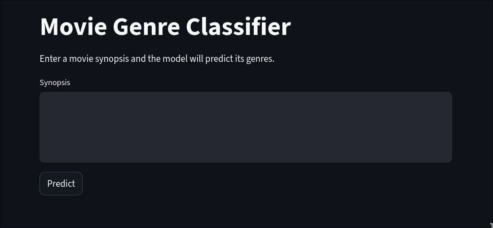
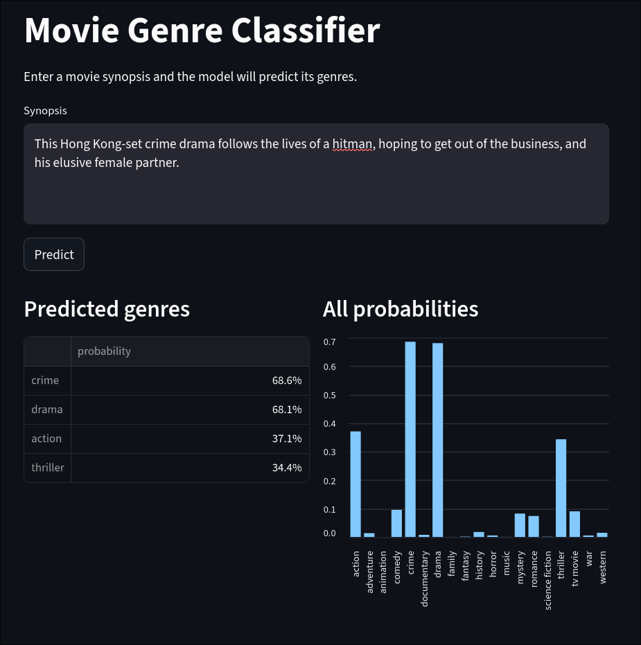

# Movie Genre Classifier

A multi-label movie genre classifier trained on synopsis text using a Bidirectional LSTM neural network. Given a plain-text movie synopsis, the model outputs a probability for each of the 19 TMDB genre classes, with per-class thresholds tuned on a held-out test set.

A Streamlit frontend allows interactive inference directly in the browser.




---

## Problem formulation

This is a **multi-label text classification** problem: a single movie can belong to multiple genres simultaneously (e.g. *Action* and *Science Fiction*). The output layer uses sigmoid activations rather than softmax, so each class is treated as an independent binary decision:

$$\hat{y}_k = \sigma(z_k) = \frac{1}{1 + e^{-z_k}}, \quad k = 1, \dots, K$$

The final prediction for class $k$ is:

$$\text{genre}_k = \mathbf{1}[\hat{y}_k \geq \tau_k]$$

where $\tau_k$ is a per-class threshold tuned independently on the test set.

---

## Data source

Data is fetched from the **[TMDB API](https://developer.themoviedb.org/docs)** (The Movie Database) via the `/discover/movie` endpoint, filtered by release year. Each record contains:

| Field | Description |
|---|---|
| `title` | Movie title |
| `overview` | Plain-text synopsis |
| `genres` | Pipe-separated genre labels (e.g. `Action\|Drama`) |
| `year` | Primary release year |

Movies without an overview or without any genre tag are discarded at parse time. The dataset spans configurable year ranges and is saved locally as CSV files under `data/`.

### Genre classes (19 total)

`Action`, `Adventure`, `Animation`, `Comedy`, `Crime`, `Documentary`, `Drama`, `Family`, `Fantasy`, `History`, `Horror`, `Music`, `Mystery`, `Romance`, `Science Fiction`, `TV Movie`, `Thriller`, `War`, `Western`

---

## Architecture

```
Input (raw synopsis string)
    │
    ▼
TextVectorization       max_tokens=20 000, output_sequence_length=200
    │
    ▼
Embedding               input_dim=20 001, output_dim=256
    │
    ▼
SpatialDropout1D        rate=0.2
    │
    ▼
Bidirectional(LSTM)     units=128 (64 per direction), return_sequences=False
                        kernel_regularizer=L2(1e-4)
                        recurrent_regularizer=L2(1e-4)
    │
    ▼
Dropout                 rate=0.3
    │
    ▼
Dense                   units=128, activation='relu', kernel_regularizer=L2(1e-4)
    │
    ▼
Dense                   units=19, activation='sigmoid'
```

**Why Bidirectional LSTM?** A standard LSTM only processes the sequence left-to-right, so the hidden state at each token only has access to prior context. The bidirectional wrapper runs a second LSTM right-to-left and concatenates both hidden states, allowing the model to use both past and future context when encoding each word in the synopsis.

### LSTM gate equations

$$f_t = \sigma(W_f x_t + U_f h_{t-1} + b_f) \quad \text{(forget gate)}$$
$$i_t = \sigma(W_i x_t + U_i h_{t-1} + b_i) \quad \text{(input gate)}$$
$$o_t = \sigma(W_o x_t + U_o h_{t-1} + b_o) \quad \text{(output gate)}$$
$$\tilde{c}_t = \tanh(W_c x_t + U_c h_{t-1} + b_c) \quad \text{(candidate cell state)}$$
$$c_t = f_t \odot c_{t-1} + i_t \odot \tilde{c}_t$$
$$h_t = o_t \odot \tanh(c_t)$$

---

## Training

### Loss

Binary cross-entropy, summed independently over all $K$ classes:

$$\mathcal{L} = -\frac{1}{N} \sum_{i=1}^{N} \sum_{k=1}^{K} \left[ y_{ik} \log \hat{y}_{ik} + (1 - y_{ik}) \log (1 - \hat{y}_{ik}) \right]$$

### Class weighting

To handle the strong genre imbalance (Drama and Comedy dominate; Western and War are rare), each class $k$ receives a weight inversely proportional to its frequency:

$$w_k = \frac{N}{K \cdot \sum_{i=1}^{N} y_{ik}}$$

### Optimizer & schedule

- **Adam**, learning rate $3 \times 10^{-4}$
- **Early stopping** on `val_loss`, patience = 10, restoring best weights
- **Batch size**: 64, **max epochs**: 50, **validation split**: 20%

### Per-class threshold tuning

After training, the decision threshold $\tau_k$ for each class is tuned independently on the test set by searching over $\tau \in [0.05, 0.95]$ in 50 steps and selecting the value that maximises the binary F1 score for that class:

$$\tau_k^* = \arg\max_{\tau} \ F1\bigl(y_{\cdot k},\ \mathbf{1}[\hat{y}_{\cdot k} \geq \tau]\bigr)$$

Tuned thresholds are saved alongside the model and loaded automatically at inference time.

### Evaluation metrics

| Metric | Description |
|---|---|
| **F1 Macro** | Unweighted mean F1 across all 19 classes — penalises poor performance on rare genres |
| **F1 Micro** | Pooled TP/FP/FN across all classes — reflects overall label-level accuracy |
| **Hamming Accuracy** | $1 - \text{Hamming loss}$ — fraction of correct label decisions per sample |

---

## Project structure

```
classifier_synopsis/
├── app.py                  # Streamlit frontend
├── main.py                 # CLI entry point
├── scripts/
│   ├── train.py            # Training pipeline
│   └── predict.py          # Inference pipeline
├── src/
│   ├── model.py            # genrePredictor class
│   └── preprocessing.py    # Data loading and feature/label prep
├── parser/
│   └── parser.py           # TMDB API data fetcher
├── models/
│   └── lstm/               # Saved model artifacts
│       └── <timestamp>/
│           ├── model.keras
│           └── metadata.json
└── data/
    └── movies_*.csv
```

---

## Usage

### 1. Fetch data from TMDB

```bash
python main.py parse --API_KEY <your_key> --start_year 2000 --end_year 2023
```

Optional: `--max_limit 50000` (default).

### 2. Train

```bash
python main.py train
```

Trains the model, tunes thresholds, prints evaluation metrics, and saves the model under `models/lstm/<timestamp>/`.

### 3. Predict via CLI

```bash
# Single synopsis
python main.py predict --text "A young wizard discovers his magical heritage and enrolls in a school for witches and wizards."

# Batch
python main.py predict --batch "Synopsis one" "Synopsis two"
```

### 4. Streamlit app

```bash
streamlit run app.py
```

---

## Dependencies

```
tensorflow
scikit-learn
pandas
numpy
matplotlib
streamlit
requests
tqdm
```

Install with:

```bash
pip install -r requirements.txt
```

> **GPU note:** TensorFlow's pip package targets CUDA 12.x. If your system CUDA is newer (e.g. after a rolling-release upgrade), install the bundled variant to avoid version mismatches:
> ```bash
> pip install "tensorflow[and-cuda]"
> ```
